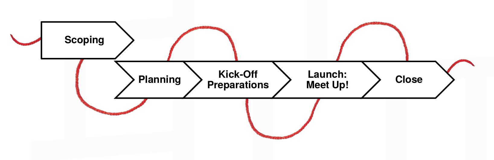
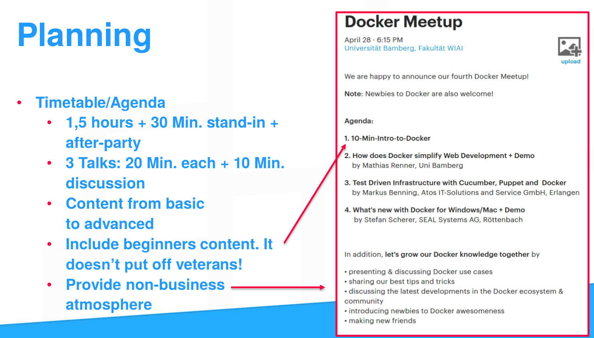

# What is this guide about?

Docker Meetups are social events organized by community members who are interested in talking and learning about the Docker projects.

Anyone how is interested in meeting with others to discuss about Docker is welcome to organize Meetups. We simply ask our organizers to comply with our Code of Conduct and ensure everyone in the community feels welcome!

This guide helps you to successfully organize Docker Meetups. It provides tips, checklists and concepts to do your planning effectively.

# Preparation
At first, make sure you answer the following questions:

  - **Bootstrap or contribute:** Anyone can start a Docker Meetup group as long as there is not an existing Docker user group in your city. Check out the [Docker community page](https://www.docker.com/community/meetup-groups) to make sure a group does not already exist in your region.
  - **Team up – but stay with a single coordinator.**
  In case do opt for bootstrapping the meetup, try go get others involved. Spread the tasks across several shoulders, but make sure there is a single responsible who manages all important information.
  - **Check: Commitment**: Ask yourself: In case the first meetup works out well, will you take enough time to organize a second and a third one? It's not worth it for just a single one. Organizing Meetups is very rewarding in several aspects, but it's organize within a fingers snap.

# Structure Your Meetup Project
If you decided to start, email us at meetup@docker.com to tell us in which city you wish to launch a Docker group. Let us know where you plan to host your first Docker Meetup and/or if we can help you find a venue. Let us know if you have any sponsors or speakers in mind so we can share resources.
Once the group is launched, we recommend scheduling the first meetup with enough lead time for successful promotion.

Next, make yourself familiar with the three most relevant tools:
  - Mobilize.com: It provides updates from Docker and the Community
  - Github.com: You wanna document here everything you do, e.g. TODO lists
  - Meetup.com: Publish events and track attendees

As a red thread through the organizing process, you can use the following phases to structure your planning:

Start with a scoping phase that shapes the general purpose of your meetup series. In this phase, you answer questions like: Do I want to organize simple, open discussions about Docker or I want to invite speakers. All the remaining phases belong to a single meetup, i.e. for each meetup you start with planning and finish up with the closing phase. Following this red thread will make it easy for you to always have an overview what's important now and next.

## Scope
  - **Define your scope and goal:** All subsequent planning steps are aligned to the scope and goal you define. Deine, what kind of Meetup you wanna run:
  Usually, Docker Meetup events are 2-3 hours long, start between 4pm and 7pm and feature 1 to 3 main talks lasting 20-30 minutes each. The agenda is up to each Meetup Community, so feel free to mix or exchange this with e.g.
    - simple social gatherings to discuss Docker projects
    - 10-minute lightning talks
    - Docker Training
    - How-to tutorials
    - Panels
    - Presenting use cases
    - Advanced technical deep dives
  - **Target Group**: Advertisement for Students is very much different than it is for employees. Define your target group to allocate appropriate ad resources later on.
  - **Frequency:**: Having a regular meetup date is key to an active group. Consistent meetups are essential in building a thriving community. Is there a certain time that works best for everyone? How often will you meet? No matter what your group decides, allowing enough time to travel to the meetup location and holding frequent, regular meetup events are two significant catalysts for a strong and active meetup group.

## Planning
We recommend to create a single planning document, i.e. a Markdown file for each Meetup. Using Github for that eases file versioning and eases editing since Github is a familiar platform.
This planning document should gather all relevant information for the particular Meetup, divided in categories and tasks. See the following slide as example (it's in german, but you'll get the general idea):

Each category contains a set of associated tasks. Thereby, each tasks ideally has
- a checkbox to track the progress
- the name of the one who is responsible for the tasks
- a deadline, if appropriate

See the the following as example:

### Plan each category

Next, see the following tips for each category:

  - **Advertisement**:
  General advice: Try and error, after the third meetup you'll have a good feeling of which ad is useful or not.
  Indoor, doors that are often used is very recommended, such as entrances to cafeterias in your company or at university.

  You can help with promoting your event across Docker’s social media channels. Once your meetup page is created, we’ll add your group to the global map and include it in our meetup groups.

  Docker will tweet about your meetup events and include them in the events section on docker.com and in the Docker Weekly newsletter.

  Encourage members to invite friends and colleagues to meetups! Messaging through meetup.com is an effective way to encourage more communication and activity among members. The more the merrier!

  Join forces! You may consider joining forces with another complementary meetup group with shared interests and goals. For new groups - perhaps in more remote locations - cross-promotion can be a great way to kickstart and establish the group’s presence. You can create an event together and then share it with each group’s members to multiply attendance. This encourages and builds the community on both sides.

  In all advertisements, you wanna reference to the meetup.com event page. Changing details on meetup.com is way easier then on all already published ads.

  For more advice on how to promote your meetup, check out the official meetup.com promotion page.

  - **Venue**:
  Organizing a Venue might take some time. Make sure this is one of the tasks you allocate resources to early.
  Message members in the group to see if they know of any companies that might be willing to offer office space for the meetup. Since meetups occur after traditional business hours, this request should not interfere with business activities.
  Research where other local developer groups (such as Python, Ruby or Golang user Groups) hold meetups.
  Reach out to companies in the Docker ecosystem that have offices in your local area.

  Make sure the venue is centrally located and that parking is readily available if you anticipate participants to travel by car or bike.
  Provide directions on the Meetup.com event page, with e.g. a Google Maps link oven even a [short video](https://www.youtube.com/watch?v=mt7no76ZHGQ).  

  The building should also be handicap accessible.

  Consider to send your phone number to all attendees 2-3 days before the meetup, or get a cheap SIM card and burning phone for this purpose.

  Consider the size of the room and design. Does it complement the format of event you want to host? Is there an adequate number of chairs? A room can also be too big. If you only expect 20 people, avoid booking a room that can hold 100 as it will feel empty.

  Does the building have security? If so, what is the check in procedure? What information do they require in advance?
  Is the hosting venue willing to sponsor food and beverage? It's also a great help if they can coordinate ordering and deliveries, but always offer to assist since they are already being gracious.
  What audio/visual equipment is available at the venue? Do they have a microphone, projector/Apple TV available for presentations?

  When in doubt, feel free to reach out to Victor Coisne (victor@docker.com)

  - **Equipment:**
  Make sure you'll have presentation tools at the venue incl. a beamer, presenter, and AV if necessary.
  Consider to provde small gifts to the speaker. Sometimes, speaker have come a very long way. A small gift compensates for that. Just the same as important: It also motivates the speaker to come again, and it motivates others to give talks!
  Ask Docker for swags: Get give-aways as e.g. stickers from Docker, the sponsors and the venue if applicable. This gives attendees a feeling it was even more worth to come in person.  

  - **Speakers**
  In general, good speakers are rare, often busy themselves, but important for a good meetup series.
  Even if the speaker's content seems very well, some speakers cannot properly deliver their content. But precheck is hard. Therefore, try to see the speaker once in advance, e.g. on other Meetups.

  Message members in the group to see if they would like to present or if they know of any speakers from their network.
  Is there anyone from the Docker Team in the local area who could give a talk?
  Find local developer conferences, review the speaker list, and identify if anyone could be using Docker. Conferences can be tracked on lanyrd.com.
  If members feel that a full presentation with slides is too much of a time commitment, a shorter lightning talk of 5-10 minutes or a quick demo is also great! Everyone can learn something from each other.
  Tip in selecting appropriate speakers: talks should not be a sales pitch, but can however showcase a company’s tech and how it uses Docker. We also don’t expect speakers to “oversell” Docker. They should “be themselves” and formulate a talk they feel would be relevant to Docker users.

  Have a moderater (can by anyone who feels good in doing this) that leads through the talks. Start with a warm welcome, announce each talk and wish everyone a good safe home. It's that easy.

  Ask Docker for an employee to come by. If it's possible to align this to their travels, this is a big plus for the agenda.

  Don’t hesitate to ask Docker community managers for advice!

  - **Timetable**
  Prefer to run the meetup outside of typical business hours - evenings tend to work best for most groups. Weekdays like Tuesday, Wednesday or Thursday work best: meeting during the workweek gives your group its best chance for a higher turnout (especially in North America and Europe).
  Note that in Asia, meetups scheduled during the weekend also tend to be very well attended.

  When considering the date for your meetup, conduct a thorough search of other meetup groups in your local area that Docker users may already be attending. Consider, for example, when the Go or DevOps user groups meet and try to avoid scheduling your meetup events on coinciding days. You don’t want to force your attendees to choose between events - they (yourself included) may want to attend both!

  Are holidays coming up or conferences happening close by that your members might attend? Consider scheduling the meetup so that both you and your members can participate in the event, or better yet, create a complementary meetup around the conference dates. Being flexible helps both you and the group maximize the time you have together.

  Unsure about dates and times? Poll the group!

  - **Event description on Meetup.com:** On the event's meetup.com page, providing enough information about the program is conducive to higher attendance. Haven’t finalized all of the details? Don’t worry - post the meetup anyway so it is on everyone’s radar. Update your post as details come. Just note if there are significant changes to the event (like cancelling a speaker); they may be infrequent, but it can affect turnout.

  Post the agenda if you have one. List start and end times, what time the presenter will speak, as well as any other details to let attendees know what to expect. Does the presenter have a biography and photo to share? What’s their Twitter or GitHub account? How about a brief abstract and/or talk title? Let your group get to know both the speaker and topic(s).

  Are there any venue-specific instructions attendees should know? Add some helpful tips about the meeting location and what to do once there, so getting to the meetup is as easy as possible.

  Here is a [good example of a good meetup description] (http://www.meetup.com/Docker-meetups/events/226172627/) you may want to use as a starting template. Also see the following one as an example:

  

  - **Catering:**
  Ask yourself if this is necessary. In any case, this is a bit more effort to organize. Especially if you don't have a sponsor for that, consider to to an After-Party at a nearby restaurant. This enables you to shift expenses from you to the attendees.

  However, never forget about drinks, even if you serve just water. If you provide bottles, remember to bring cups. Otherwise, you'll end up with lots of half-filled bottles you cannot store any more.

  Consider food that is easy to eat and require minimal utensil usage. You want attendees to network and socialize easily without worrying about how to eat their food. Most groups opt for pizza, but variety is appreciated. They also don’t want to make a mess and you probably don’t want to stay late cleaning up after them. It’s also a good idea to provide options for those with different diets, such as: vegetarian, vegan, gluten-free, Kosher, etc. No hungry engineers here!

  Regarding the drinks: Many groups choose to offer alcohol, while many others choose not to - it is up to you. Be sure to follow and respect the venue’s rules around alcohol consumption on their premises - you want to be invited back! Provide drink alternatives, including and especially water. Don’t forget to watch out for the openly inebriated! You want your members to feel safe and return without the memory of a bad experience.

  If your group is able to secure a sponsorship, be sure to list the sponsor in the event announcement and thank them before presentations. Let your group know if food and drinks will be provided so attendees can plan their meals ahead of time.

  - **Finances:**
  Maintain a list of all expenses to always have an overview about all of them.
  Make sure you have a bank account to receive donations by sponsors. If you organize provide an account too late, sponsors might not pay any more.

## Kick-Off Preparations
In this phase you basically start to do what you planned, e.g. buy equipment, drinks, cups, etc.
Visit the venue and think about directions you need to provide, get in touch with responsibles of the venue.
Check the presentation equipment.
...

## Lauch: Meetup up!
Plan to be finished 15 Min. before the Meetup officially starts. You'll need this buffer anyway :-)
Let the moderator start starting the show, e.g. by asking the crowd where they come from etc.
Manage the speakers' time by two simple methods:
  - During his talk, sit in the first row. 5 Min. before the speaker's time is over, stand up and move to the front in a way that you don't disturbe the talk, but the speaker recognizes you.
  - Move closer to the speaker the more the is overdue.

##  Closing
This phase is all about getting feedback. Really good feedback requires asking for it. Use offline and online channels to do so.
With your co-organizers, rethink the event and gather ideas to improve.
Document all your feedback and ideas for next time.
Don't forget to distribute the slides for attendees.
If applicable, write a blog post about the meetup with pictures and its highlights. If Docker retweets it or includes this post in the Docker weekly, you meetup receives attention bonus points.

# Online Resources available to Meetup organizers

#### [Mobilize] (https://docker.mobilize.io)
Mobilize is a simple communication & directory tool for us to share events, activities, and programs with groups of active community members. All our members can easily reach one another. You can open discussions among selected members, send direct messages, share ideas and experiences, get help finding sponsors and speakers and help other members succeed and run great meetup events. When the community supports each other, everyone wins!
The Docker Community page.

#### [Docker Blog] (https://blog.docker.com/)
The Docker Blog is a great resource to find content! We post the latest Docker news including new releases and events like DockerCon there. For our curated collection of content from the community, check out this page: http://www.scoop.it/t/docker-by-docker

####[Docker Weekly](https://www.docker.com/newsletter-subscription)
Get the latest Docker news straight to your inbox! This weekly newsletter highlights content from the community along with the latest Docker news.

#### [Docker Docs] (https://docs.docker.com/)
Get all the info on the different Docker projects with our docs.

#### [Slideshare] (http://www.slideshare.net/docker)
Another great resource for finding content! Docker’s Slideshare account has slide decks from Docker presentations - you’re welcome to use and/or modify these slides when presenting to your own meetup group.

#### [Youtube] (https://www.youtube.com/user/dockerrun)
Check out our YouTube page for videos of recorded talks from DockerCon, webinars and other meetups.

#### Social Media
Follow us on [Twitter] (https://twitter.com/docker), join the Docker community on [Google+](https://plus.google.com/u/0/communities/108146856671494713993), like Docker on [Facebook](https://www.facebook.com/docker.run) and join the Docker Users Group on [LinkedIn] (https://www.linkedin.com/company/docker)
